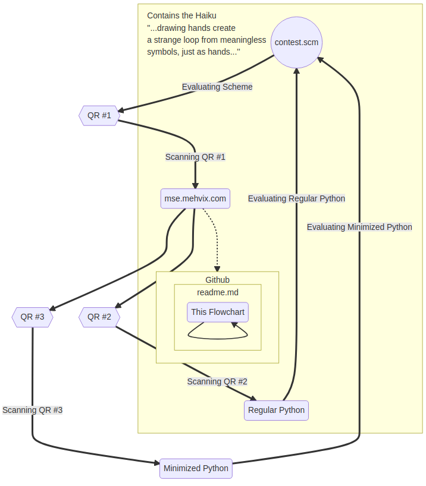

# MSE

M. Scheme EschQR  
Scheme 
EschQR 

---

> ...[drawing hands](https://en.wikipedia.org/wiki/Drawing_Hands) create 
> a [strange loop](https://en.wikipedia.org/wiki/Strange_loop) from meaningless  
> symbols, just as hands... 

---

_Initially created for the [CS61A Scheme art contest](https://cs61a.org/proj/scheme_gallery/#mse-m-scheme-eschqr)._
